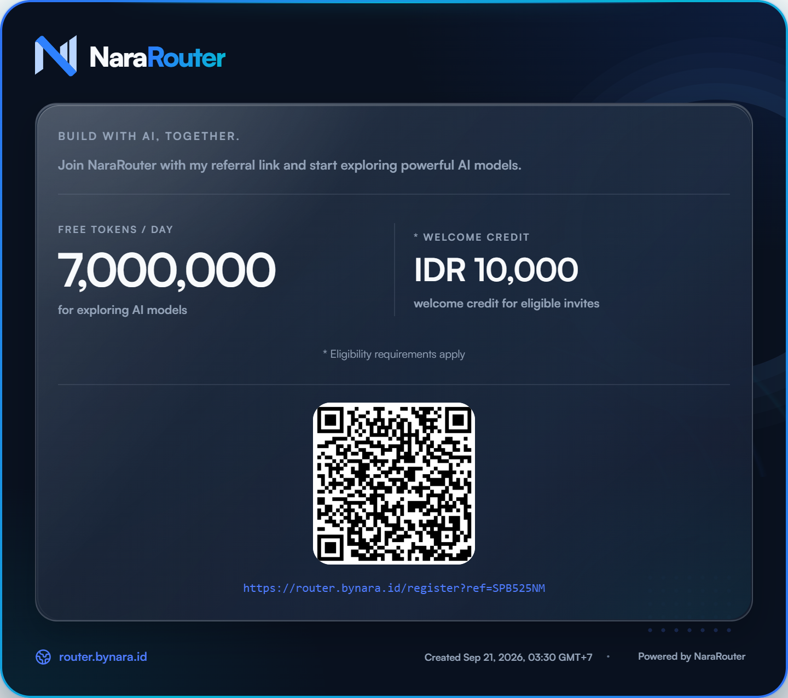

# HipHopono

> A self-hosted, browser-based AI coding agent — like Claude Code, OpenCode CLI, Codex CLI, Zed AI, or Cursor Agent, but running entirely from your browser against your own machine.


AI Web CLI lets you open any project folder on your server, chat with an LLM, and let the agent **read, edit, create, rename, and delete files** and **run terminal commands** — all with explicit user approval. No cloud lock-in. No `localStorage`. Everything persists to plain JSON files on disk.

---
[نسخه فارسی](fa.readme.md)
## ✨ Features

### 🖥️ Browser Workspace
- **VSCode-style editor** with tabs, syntax highlighting, search & replace, unsaved indicators, auto-save, drag-to-reorder tabs, markdown preview, and multi-tab editing.
- **File explorer** with lazy-loaded tree view, create file / folder, rename, delete, and `.gitignore` awareness.
- **Integrated terminal** (xterm.js) supporting `cmd`, PowerShell, Git Bash on Windows, and `bash` / `zsh` on Linux/macOS. Multiple terminals, stdin/stdout/stderr, long-running processes, and kill support.
- **Resizable panels** and **split views** with a modern dark UI.
- **Command Palette**, status bar, notifications, problems panel.

### 🤖 AI Agent
- Configurable **OpenAI-compatible** or **Anthropic Messages** APIs — no hardcoded providers.
- **Streaming responses** with stop / retry / continue.
- Internal tools: `read_file`, `write_file`, `apply_patch`, `create_file`, `delete_file`, `rename_file`, `list_dir`, `glob`, `grep`, `run_command`, `git_status`, `git_diff`, `git_log`, `git_commit`, `git_branch`.
- **Approval mode** — every mutating action asks for permission with a diff preview.
- Dangerous-command denylist, process-tree kill on timeout, 1 MB stdout/stderr caps.

### 📁 Projects & Git
- Open any folder on the server (must be a Git repository — `.git` required).
- Automatic Git detection: current branch, modified files, diffs, commit history.
- Recent / favorite / pinned projects.
- Optional **File System Access API** mode (feature-detected) to open folders from the browser.

### 🧠 Skills System
- Auto-discovers skills from `.skill/`, `.skills/`, `.opencode/`, `.claude/`, `.codex/`, `.cursor/`, `.zed/`, `.rules/`, `.ai/`, `.agent/`, `.prompts/` — both **project-scoped** and **user-scoped** (`~/.claude/skills`, etc.).
- Reads `.md`, `.json`, `.yaml`, `.txt` skill files; parses YAML frontmatter (`name`, `description`, `allowed-tools`).
- Merges all skills into one runtime prompt.
- Every skill is exposed as a **slash command** (`/my-skill`) and as a **tool** (`skill__my-skill`) the LLM can invoke.
- Enable / disable, priorities, and hot-reload from the UI.

### 💬 Chat & Memory
- Multiple conversations, conversation search, pinned chats, rename, delete.
- Markdown rendering, code highlighting, copy buttons, attachments, and images.
- **Project Memory**, **Global Memory**, **Session Memory**, and **Pinned Memory** — all stored server-side in JSON.
- Export / import conversations.

### ⚙️ Settings (`/setting`)
Everything configurable from the UI — never edit code:
- **Model / Provider**: model name, API URL, API token, format (openai / anthropic), temperature, top-p, max tokens, headers, timeout, retries.
- **Agent Behavior**: system prompt, auto-save, auto-execute, approval mode, danger mode, read-only mode.
- **Appearance**: theme, language.
- **Terminal**: shell, workspace root.
- **Filesystem**: allowed extensions, ignored files, ignored directories.
- **Git**, **Skills**, and **Memory** settings.
- **Account**: change username / password, logout, danger zone.

---

## 🧱 Tech Stack

| Layer | Technology |
|---|---|
| **Backend** | Node.js ≥ 20, Express, TypeScript (ESM) |
| **Frontend** | React 18, Vite, TypeScript, React Router |
| **Styling** | Tailwind CSS (dark, terminal-inspired theme) |
| **Database** | JSON files only — no SQL, no ORM, no Redis |
| **Auth** | HTTP-only cookies + sessions; `scrypt` password hashing |
| **Streaming** | Server-Sent Events (SSE) — no WebSockets |
| **Terminal** | xterm.js + xterm-addon-fit |
| **Markdown** | react-markdown + remark-gfm |
| **Validation** | zod |

> **Hard rule:** No `localStorage`, no `sessionStorage`, no app state in IndexedDB. All persistent data lives in JSON files on the server.

---

## 📂 Project Structure

```
ai-web-cli/
├── package.json                  # npm workspaces (server, client)
├── .env.example
├── database/                     # JSON DB (gitignored)
│   ├── users.json
│   ├── settings.json
│   ├── sessions.json
│   ├── projects.json
│   ├── conversations.json
│   ├── messages.json
│   ├── skills.json
│   ├── models.json
│   ├── agents.json
│   ├── prompts.json
│   ├── terminal.json
│   ├── logs.json
│   └── history.json
├── server/
│   └── src/
│       ├── index.ts
│       ├── env.ts
│       ├── db/           (db.ts, schema.ts, seed.ts)
│       ├── middleware/   (auth.ts, rateLimit.ts, errors.ts)
│       ├── routes/       (auth.ts, settings.ts, fs.ts, project.ts,
│       │                  skills.ts, chat.ts, conversations.ts)
│       ├── services/
│       │   ├── llm/      (openai.ts, anthropic.ts, index.ts)
│       │   ├── agent/    (loop.ts, tools.ts, approvals.ts, context.ts)
│       │   ├── skills/   (scanner.ts, parser.ts)
│       │   ├── git.ts
│       │   └── fsSafe.ts
│       └── types/
└── client/
    └── src/
        ├── main.tsx, App.tsx, router.tsx
        ├── lib/api.ts
        ├── context/      (AuthContext, ProjectContext, SettingsContext)
        ├── pages/        (Login, Workspace, Settings, ProjectPicker)
        ├── components/   (Terminal/, FileTree/, ChatMessage/,
        │                  ToolCallBlock/, DiffViewer/, ApprovalModal/,
        │                  Sidebar/, TopBar/)
        └── styles/
```

---

## 🚀 Getting Started

### Prerequisites
- **Node.js ≥ 20**
- **npm ≥ 10**
- A Git repository on disk that you want to open.

### 1. Install

```bash
git clone <your-repo-url> ai-web-cli
cd ai-web-cli
npm install
```

### 2. Configure environment

Copy `.env.example` to `.env` and adjust:

```env
PORT=3001
SESSION_SECRET=change-me-to-a-long-random-string
WEbCODE_ALLOWED_ROOTS=/home/your-user
DATA_DIR=./database
```

### 3. Run in development

```bash
npm run dev
```

- Frontend → [http://localhost:5173](http://localhost:5173)
- Backend  → [http://localhost:3001](http://localhost:3001) (Vite proxies `/api`)

The server automatically:
1. Creates the `database/` directory and any missing JSON files.
2. Seeds an **admin** account if `users.json` is empty.
3. Writes the initial credentials to `database/INITIAL_CREDENTIALS.txt` **and** prints them to the console.
4. Loads default settings and scans for skills.
5. Starts the API and serves the frontend.

### 4. First login

Use the admin credentials from the console (or `INITIAL_CREDENTIALS.txt`).  
You will be forced to change the password on first login.

### 5. Build for production

```bash
npm run build
npm start
```

---

## 🔐 Security

- **Path traversal prevention** — every filesystem operation goes through `fsSafe.ts`, which:
  - resolves to an absolute real path,
  - enforces a configurable allowlist root (`WEbCODE_ALLOWED_ROOTS`),
  - rejects `..`, null bytes, and symlinks pointing outside the workspace.
- **Hashed passwords** — `scrypt` with per-user random salt; no plaintext ever stored.
- **API tokens never leave the server** — the client only sees `apiTokenSet: true` and a masked preview (`sk-…abcd`).
- **Command denylist** — blocks `rm -rf /`, `sudo`, `curl | sh`, fork bombs, etc.
- **Approval before dangerous actions** — writes, deletes, and shell commands require confirmation unless auto-approve is explicitly enabled.
- **Rate-limited login** — 10 attempts per 15 min per IP + username.
- **Audit log** — every mutating action is written to `database/logs.json`.
- **Session cookies** — `httpOnly`, `sameSite=lax`, `secure` in production.

---

## 🔌 API Surface

```
GET    /api/health
POST   /api/auth/login
POST   /api/auth/logout
POST   /api/auth/change-password
GET    /api/auth/me

GET    /api/settings
PUT    /api/settings
POST   /api/settings/test-connection

GET    /api/fs/browse?path=
GET    /api/fs/tree?projectId=&path=
GET    /api/fs/file?projectId=&path=

POST   /api/project/open
GET    /api/project/recent
POST   /api/project/close

GET    /api/skills?projectId=
GET    /api/conversations?projectId=
POST   /api/conversations
GET    /api/conversations/:id/messages
DELETE /api/conversations/:id

POST   /api/chat                 (SSE stream)
POST   /api/chat/approve
POST   /api/chat/abort
```

Every route is `requireAuth`-guarded (except `/api/health` and `/api/auth/login`), zod-validated, and returns `{ error: "CODE", message: "..." }` on failure.

---

## 🧠 Adding a Skill

Create a folder in your project or home directory, e.g.:

```
.skill/example-skill/SKILL.md
```

```markdown
---
name: example-skill
description: Explains how the example skill works.
allowed-tools: read_file, grep
---

When the user asks about X, do Y.

1. Read the config.
2. Grep for the relevant key.
3. Summarize the result.
```

Reload the workspace — the skill appears in the sidebar and is available as `/example-skill` and as the tool `skill__example-skill`.

---

## 🐳 Docker

```bash
docker compose up -d
```

Mount your project folder and the `database/` directory as volumes. See `docker-compose.yml`.

---

## 📜 npm Scripts

| Script | Description |
|---|---|
| `npm run dev` | Run server + client in watch mode |
| `npm run build` | Type-check and build both workspaces |
| `npm start` | Run the production server |
| `npm run typecheck` | Run `tsc --noEmit` across the monorepo |
| `npm test` | Run unit tests (including the DB concurrency test) |

---

## 🗺️ Build Order (for contributors)

1. Monorepo scaffolding, TypeScript configs, Tailwind, Express boot, `/api/health`.
2. JSON DB layer with atomic writes + a 1000-concurrent-write test.
3. Auth: seed admin, login/logout/me, cookie sessions, `requireAuth`, rate limiting.
4. Settings API + `/setting` page + test-connection.
5. Filesystem safety layer + browse/tree/file endpoints.
6. Project open/validate/recent + project picker page.
7. Skills scanner + parser + `/api/skills` + sidebar list.
8. LLM provider adapters (OpenAI + Anthropic) with streaming.
9. Agent loop with tools, approval flow, and SSE.
10. Workspace UI: terminal, message rendering, tool-call blocks, diff viewer, approval modal.
11. Slash commands and command history.
12. Polish: error states, loading skeletons, empty states, keyboard shortcuts, README, Docker.

---

## 🛠️ Troubleshooting

| Problem | Fix |
|---|---|
| "This folder is not a git repository." | Ensure the selected folder contains a `.git` directory. |
| Cannot open a folder outside home | Add the path to `WEbCODE_ALLOWED_ROOTS`. |
| `Test connection` fails | Check API URL, token, and format (openai vs anthropic). |
| Terminal command hangs | Increase `commandTimeoutMs` in Settings or kill the process. |
| Forgotten admin password | Delete `database/users.json` and restart — new credentials will be generated. |

---

## 🤝 Sponsor

Our coding AI provider is **[NaraRouter](https://router.bynara.id/register?ref=SPB525NM)**. Register with the link above to get:

- **7M free tokens** to start building immediately
- **10,000 IDR credit** for PAYG (pay-as-you-go) models



---

## 📄 License

MIT — see `LICENSE`.

---

## 🙌 Acknowledgements

Inspired by **Claude Code**, **OpenCode CLI**, **ZAI** and **Nara Router**.  
Built with ❤️ using only Node.js, Express, TypeScript, React, Vite, and plain JSON files.
